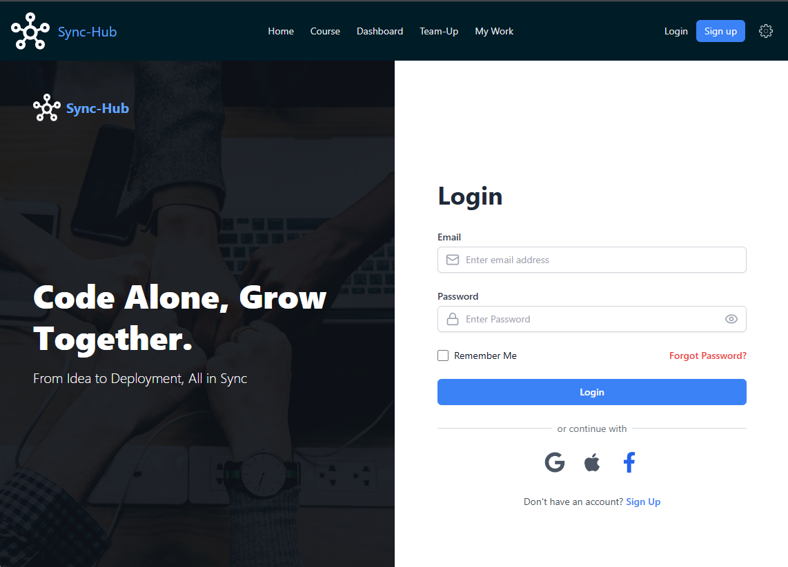

# Sprint 1 Review

## Done vs Sprint Goal
- Goal: Implement UX,UI and make basic apps as React-app
- Completed stories: No
- Partially completed:1,2,3 

## Demo Notes
- Show: 
 - Made responsive UI and coding html/css part
   basic structure in common.css
   
   
- Stakeholder questions/feedback:
  - N/A

## Product Backlog Updates
- New items:

- Reprioritized items:
  - N/A
